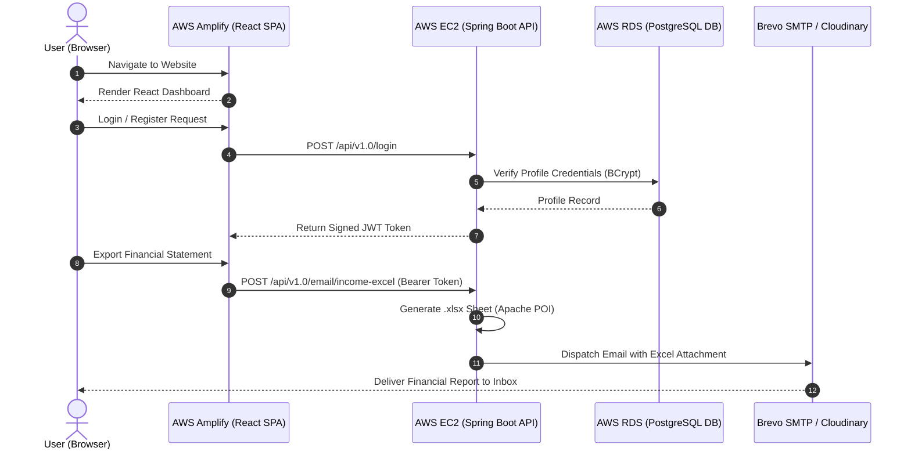

# 💰 Money Manager - Full-Stack Financial Management Platform

[](https://main.d3uek5tbugoad1.amplifyapp.com)
[](http://13.53.46.222/api/v1.0/health)
[](https://aws.amazon.com/rds/)
[](https://spring.io/projects/spring-boot)
[](https://react.dev)
[](LICENSE)

> A enterprise-grade, production-ready **Personal Finance & Expense Management Platform** built with **Java 21, Spring Boot 3, React 18 (Vite), and PostgreSQL**, fully containerized with **Docker** and deployed on **Amazon Web Services (AWS)** architecture (Amplify, EC2, RDS) and **Vercel / Render**.

---

## 👨‍💻 Developer & Contact Details (For Recruiters)

I am actively looking for **Software Engineering / Full-Stack / Backend Developer** roles! If you are a recruiter or hiring manager interested in my work, please feel free to connect or reach out directly:

- 👤 **Developer Name**: Sujal Prajapati
- 📧 **Email**: [prajapatisujal1234@gmail.com](mailto:prajapatisujal1234@gmail.com)
- 🐙 **GitHub Profile**: [github.com/SujalPrajapati2006](https://github.com/SujalPrajapati2006)
- 🌐 **Primary AWS Live App**: [https://main.d3uek5tbugoad1.amplifyapp.com](https://main.d3uek5tbugoad1.amplifyapp.com)
- ⚡ **Secondary Vercel App**: [https://moneymanager-cyan.vercel.app](https://moneymanager-cyan.vercel.app)

---

## 🌐 Live Deployments & Cloud Architecture

| Tier | Cloud Infrastructure | Service | Live URL / Status |
| :--- | :--- | :--- | :--- |
| **Frontend (Primary)** | **AWS Amplify** | React + Vite SPA | [https://main.d3uek5tbugoad1.amplifyapp.com](https://main.d3uek5tbugoad1.amplifyapp.com) |
| **Backend (Primary)** | **AWS EC2 (Ubuntu)** | Spring Boot 3 in Docker | [http://13.53.46.222/api/v1.0/health](http://13.53.46.222/api/v1.0/health) |
| **Database (Primary)** | **AWS RDS** | Managed PostgreSQL 16 | `moneymanager-db.cfgq82gue3k6.eu-north-1.rds.amazonaws.com` |
| **Frontend (Secondary)** | **Vercel** | React 18 SPA | [https://moneymanager-cyan.vercel.app](https://moneymanager-cyan.vercel.app) |
| **Backend (Secondary)** | **Render** | Docker Container | [https://moneymanager-eysi.onrender.com/api/v1.0](https://moneymanager-eysi.onrender.com/api/v1.0) |

---

## ✨ Key Features & Engineering Highlights

- **🔐 Robust Security & Auth**: Stateless JWT (JSON Web Token) authentication with Spring Security 6, BCrypt password hashing, and custom Security Filters (`JwtRequestFilter`).
- **📊 Real-Time Financial Dashboard**: Dynamic income vs. expense analytics, monthly trend visualizers, and interactive charts powered by **Recharts**.
- **💸 Transaction Lifecycle Management**: Full CRUD operations for income streams, daily expenses, and custom financial categories with emoji icon support.
- **📄 Automated Excel Reports**: Server-side `.xlsx` report generation using **Apache POI**, downloadable directly or dispatched to user inbox via **Brevo SMTP Email Service**.
- **🖼️ Profile & Cloud Avatar Integration**: User profile management with seamless avatar image uploads integrated via **Cloudinary API**.
- **🔍 Granular Transaction Filtering**: Advanced filtering by custom date ranges, financial categories, and transaction types.
- **⚡ Production Cloud Architecture**: Containerized with Docker and deployed using AWS Free Tier architecture (AWS EC2 + AWS RDS PostgreSQL + AWS Amplify).

---

## 🛠️ Technology Stack

### Frontend Architecture
- **Core Framework**: React 18 + Vite
- **Routing & State**: React Router DOM (v6), React Context API
- **Data Visualization**: Recharts
- **UI Components & Icons**: Lucide React, React Icons, Custom CSS3 Design System
- **HTTP Client**: Axios with Interceptors & JWT Header Injection
- **Deployment**: AWS Amplify & Vercel

### Backend Architecture
- **Language & Runtime**: Java 21, OpenJDK
- **Framework**: Spring Boot 3.4.x (Web, Security, Data JPA, Validation, Mail)
- **Security**: Spring Security + JWT Token Authentication
- **Database & Persistence**: PostgreSQL 16, Spring Data JPA / Hibernate ORM, Flyway Migrations
- **File & Email Processing**: Apache POI (`.xlsx`), JavaMailSender / Brevo SMTP
- **Containerization & Hosting**: Docker, AWS EC2 (Ubuntu 24.04 LTS), AWS RDS

---

## 📐 System Architecture & Flow



---

## 🔌 Core API Endpoints

| Method | Endpoint | Description | Auth Required |
| :--- | :--- | :--- | :---: |
| `POST` | `/api/v1.0/register` | Register new user account | ❌ |
| `POST` | `/api/v1.0/login` | Authenticate & issue JWT token | ❌ |
| `GET` | `/api/v1.0/profile` | Get authenticated user profile | ✅ |
| `GET` | `/api/v1.0/dashboard` | Fetch financial summary analytics | ✅ |
| `GET`/`POST` | `/api/v1.0/incomes` | List all incomes / Add income entry | ✅ |
| `DELETE` | `/api/v1.0/incomes/{id}` | Delete income entry by ID | ✅ |
| `GET`/`POST` | `/api/v1.0/expenses` | List all expenses / Add expense entry | ✅ |
| `DELETE` | `/api/v1.0/expenses/{id}` | Delete expense entry by ID | ✅ |
| `GET`/`POST` | `/api/v1.0/categories` | Manage custom financial categories | ✅ |
| `POST` | `/api/v1.0/filter` | Filter transactions by date/category | ✅ |
| `GET` | `/api/v1.0/excel/download/income` | Download Income Excel Sheet (`.xlsx`) | ✅ |
| `GET` | `/api/v1.0/excel/download/expense` | Download Expense Excel Sheet (`.xlsx`) | ✅ |
| `POST` | `/api/v1.0/email/income-excel` | Dispatch Income Excel Report to Email | ✅ |
| `POST` | `/api/v1.0/email/expense-excel` | Dispatch Expense Excel Report to Email | ✅ |

---

## 💻 Local Setup & Development Guide

### Prerequisites
- **Node.js**: `v18+`
- **Java JDK**: `21+`
- **Maven**: `3.9+`
- **PostgreSQL**: `v15+`
- **Docker**: *(Optional, for containerized run)*

### 1. Clone Repository
```bash
git clone https://github.com/SujalPrajapati2006/moneymanager.git
cd moneymanager
```

### 2. Backend Quickstart (`money-manager`)
```bash
cd money-manager
```
Create a `.env` or set environment variables:
```env
SPRING_DATASOURCE_URL=jdbc:postgresql://localhost:5432/postgres
SPRING_DATASOURCE_USERNAME=postgres
SPRING_DATASOURCE_PASSWORD=your_password
BREVO_USERNAME=your_brevo_username
BREVO_PASSWORD=your_brevo_password
BREVO_FROM_EMAIL=your_email@domain.com
MONEY_MANAGER_FRONTEND_URL=http://localhost:5173
```
Run application:
```bash
./mvnw spring-boot:run
```

### 3. Frontend Quickstart (`moneymanagerwebapp`)
```bash
cd moneymanagerwebapp
npm install
```
Create `.env`:
```env
VITE_API_BASE_URL=http://localhost:8080/api/v1.0
```
Run development server:
```bash
npm run dev
```
Open [http://localhost:5173](http://localhost:5173) in browser!

---

## 📬 Get in Touch / Hire Me

If you're looking for a passionate developer who builds scalable, high-performance web applications using modern tech stacks, I'd love to talk!

- **Email**: [prajapatisujal1234@gmail.com](mailto:prajapatisujal1234@gmail.com)
- **GitHub**: [SujalPrajapati2006](https://github.com/SujalPrajapati2006)
- **Live AWS Project**: [Money Manager Live App](https://main.d3uek5tbugoad1.amplifyapp.com)

---

⭐ *If you find this repository helpful, please consider giving it a star on GitHub!*
