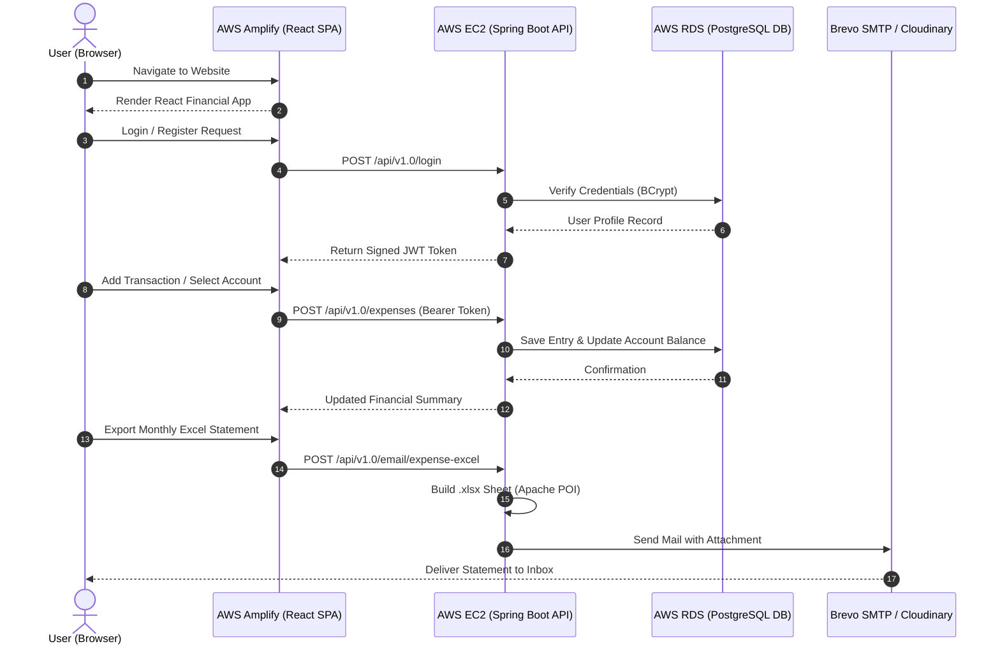

# 💰 Money Manager - Full-Stack Personal Finance Platform

[](https://main.d3uek5tbugoad1.amplifyapp.com)
[](https://sujal-moneymanager.duckdns.org/api/v1.0/health)
[](https://aws.amazon.com/rds/)
[](https://spring.io/projects/spring-boot)
[](https://react.dev)
[](https://flywaydb.org/)
[](LICENSE)

> An enterprise-grade, production-ready **Personal Finance & Expense Management Platform** built with **Java 21, Spring Boot 4, React 18 (Vite), and PostgreSQL**, containerized with **Docker** and deployed on **Amazon Web Services (AWS)** architecture (AWS Amplify, AWS EC2, AWS RDS PostgreSQL).

---

## 👨‍💻 Developer & Contact Details

I am actively looking for **Software Engineering / Full-Stack / Backend Developer** opportunities! Feel free to reach out directly:

- 👤 **Developer Name**: Sujal Prajapati
- 📧 **Email**: [prajapatisujal1234@gmail.com](mailto:prajapatisujal1234@gmail.com)
- 🐙 **GitHub**: [github.com/SujalPrajapati2006](https://github.com/SujalPrajapati2006)
- 🌐 **AWS Live Platform**: [https://main.d3uek5tbugoad1.amplifyapp.com](https://main.d3uek5tbugoad1.amplifyapp.com)

---

## 🌐 AWS Live Deployments & Cloud Architecture

| Tier | Cloud Infrastructure | Service Stack | Live URL / Health Endpoint |
| :--- | :--- | :--- | :--- |
| **Frontend** | **AWS Amplify** | React 18 + Vite SPA | [https://main.d3uek5tbugoad1.amplifyapp.com](https://main.d3uek5tbugoad1.amplifyapp.com) |
| **Backend** | **AWS EC2 (Ubuntu)** | Spring Boot in Docker + Nginx SSL | [https://sujal-moneymanager.duckdns.org/api/v1.0](https://sujal-moneymanager.duckdns.org/api/v1.0) |
| **Database** | **AWS RDS** | Managed PostgreSQL 17 | `moneymanager-db.cfgq82gue3k6.eu-north-1.rds.amazonaws.com` |

---

## ✨ Key Features & Technical Highlights

- 🏦 **Multi-Account Balance Tracking**:
  - Separate balances for **Bank**, **Cash**, **Credit Card**, and **UPI / Digital Wallet** accounts instead of a single combined total.
  - Dedicated Accounts UI (`/accounts`) for creating, editing, and deleting accounts.
  - Smart transaction re-assignment: prompts users to reassign existing transactions to another account or delete associated entries permanently.
  - Dashboard filter allowing users to toggle between *"All Accounts Combined"* and specific account metrics.

- 📊 **Monthly Budget Management**:
  - Set monthly spending caps per expense category (e.g. Food, Bills, Shopping).
  - Dynamic visual progress bars with color-coded spending thresholds (Green <70%, Orange 70-100%, Red >100%).
  - Dashboard Budget Overview widget featuring over-budget warning banners and closest limit alerts.

- 🔄 **Automated Recurring Transactions**:
  - Repeat recurring income and expense entries on **Weekly**, **Monthly**, or **Yearly** intervals with optional end dates.
  - Automated Spring `@Scheduled` daily background job that checks due recurring items, auto-creates new transaction records, and advances `nextDueDate`.

- 🛡️ **Custom Exception Infrastructure**:
  - Centralized `@RestControllerAdvice` error handler catching domain-specific custom exceptions (`UnauthorizedException`, `ResourceNotFoundException`, `ResourceAlreadyExistsException`, `InvalidCredentialsException`, `EmailSendException`).
  - Returns standardized, human-readable JSON error responses with appropriate HTTP status codes (401, 403, 404, 409, 500).

- ⚙️ **Flyway Managed Database Schema**:
  - Version-controlled SQL migration scripts (`V1_0__...` to `V20260726000200__...`) ensuring seamless database evolution without relying on Hibernate auto-ddl.

- 🔐 **Stateless JWT Security**:
  - Spring Security 6 authentication pipeline with BCrypt password encryption, custom Security Filters (`JwtRequestFilter`), and bearer token validation.

- 📄 **Automated Excel Reports & Email Inbox Dispatch**:
  - Server-side `.xlsx` financial report generation using **Apache POI**.
  - Direct sheet downloads and background email dispatch to user inboxes via **Brevo SMTP**.

- 🖼️ **Cloud Profile & Avatar Integration**:
  - Cloud avatar image upload integration powered by **Cloudinary API**.

---

## 🛠️ Technology Stack

### Frontend Architecture
- **Framework**: React 18 + Vite
- **Routing & State**: React Router DOM (v6), React Context API
- **Data Visualization**: Recharts
- **Icons & Styling**: Lucide React, React Icons, Vanilla CSS3 Design System (Glassmorphism + Dark/Light modes)
- **HTTP Client**: Axios with interceptors for token injection & auto-refresh
- **Deployment**: AWS Amplify

### Backend Architecture
- **Language & Runtime**: Java 21 (OpenJDK)
- **Framework**: Spring Boot 4.0.3 (Web, Security, Data JPA, Validation, Mail)
- **Database & Migration**: PostgreSQL 17, Spring Data JPA / Hibernate ORM, Flyway 11
- **Background Tasks**: Spring `@Scheduled` Daily Cron Jobs
- **File & Email Processing**: Apache POI (`.xlsx`), JavaMailSender / Brevo SMTP
- **Containerization & Hosting**: Docker, Nginx SSL, AWS EC2 (Ubuntu 24.04 LTS), AWS RDS PostgreSQL

---

## 📐 System Architecture & Flow


```mermaid
sequenceDiagram
    autonumber
    actor User as User (Browser)
    participant Amplify as AWS Amplify (React SPA)
    participant EC2 as AWS EC2 (Spring Boot API)
    participant RDS as AWS RDS (PostgreSQL DB)
    participant Brevo as Brevo SMTP / Cloudinary

    User->>Amplify: Navigate to Website
    Amplify-->>User: Render React Financial App
    User->>Amplify: Login / Register Request
    Amplify->>EC2: POST /api/v1.0/login
    EC2->>RDS: Verify Credentials (BCrypt)
    RDS-->>EC2: User Profile Record
    EC2-->>Amplify: Return Signed JWT Token
    User->>Amplify: Add Transaction / Select Account
    Amplify->>EC2: POST /api/v1.0/expenses (Bearer Token)
    EC2->>RDS: Save Entry & Update Account Balance
    RDS-->>EC2: Confirmation
    EC2-->>Amplify: Updated Financial Summary
    User->>Amplify: Export Monthly Excel Statement
    Amplify->>EC2: POST /api/v1.0/email/expense-excel
    EC2->>EC2: Build .xlsx Sheet (Apache POI)
    EC2->>Brevo: Send Mail with Attachment
    Brevo-->>User: Deliver Statement to Inbox
```

---

## 🔌 Core API Endpoints

| Method | Endpoint | Description | Auth |
| :--- | :--- | :--- | :---: |
| `POST` | `/api/v1.0/register` | Register new user profile | ❌ |
| `POST` | `/api/v1.0/login` | Authenticate user & issue JWT token | ❌ |
| `GET` | `/api/v1.0/profile` | Fetch active user profile | ✅ |
| `GET` | `/api/v1.0/dashboard` | Fetch dashboard analytics (optional `?accountId=`) | ✅ |
| `GET`/`POST` | `/api/v1.0/accounts` | Fetch user accounts / Create new account | ✅ |
| `PUT`/`DELETE` | `/api/v1.0/accounts/{id}` | Update account / Delete account (with re-assignment) | ✅ |
| `GET`/`POST` | `/api/v1.0/budgets` | Fetch monthly budgets / Save category budget | ✅ |
| `DELETE` | `/api/v1.0/budgets/{id}` | Delete category budget | ✅ |
| `GET`/`POST` | `/api/v1.0/incomes` | List incomes / Add new income entry | ✅ |
| `DELETE` | `/api/v1.0/incomes/{id}` | Delete income entry by ID | ✅ |
| `GET`/`POST` | `/api/v1.0/expenses` | List expenses / Add new expense entry | ✅ |
| `DELETE` | `/api/v1.0/expenses/{id}` | Delete expense entry by ID | ✅ |
| `GET`/`POST` | `/api/v1.0/categories` | Manage custom financial categories | ✅ |
| `POST` | `/api/v1.0/filter` | Search & filter transactions by date, category, account | ✅ |
| `GET` | `/api/v1.0/excel/download/income` | Download Income Excel Sheet (`.xlsx`) | ✅ |
| `GET` | `/api/v1.0/excel/download/expense` | Download Expense Excel Sheet (`.xlsx`) | ✅ |
| `POST` | `/api/v1.0/email/income-excel` | Send Income Excel Report to Email Inbox | ✅ |
| `POST` | `/api/v1.0/email/expense-excel` | Send Expense Excel Report to Email Inbox | ✅ |

---

## 💻 Local Setup & Development Guide

### Prerequisites
- **Node.js**: `v18+`
- **Java JDK**: `21+`
- **Maven**: `3.9+`
- **PostgreSQL**: `v15+`

### 1. Clone Repository
```bash
git clone https://github.com/SujalPrajapati2006/moneymanager.git
cd moneymanager
```

### 2. Backend Quickstart (`money-manager`)
```bash
cd money-manager
```
Set environment variables or create `src/main/resources/application.properties`:
```properties
spring.datasource.url=jdbc:postgresql://localhost:5432/postgres
spring.datasource.username=postgres
spring.datasource.password=your_password
spring.flyway.enabled=true
spring.mail.properties.mail.smtp.from=your_email@domain.com
jwt.secret=your_jwt_secret_key_min_32_characters_long
```
Compile and run Spring Boot application:
```bash
./mvnw spring-boot:run
```

### 3. Frontend Quickstart (`moneymanagerwebapp`)
```bash
cd moneymanagerwebapp
npm install
```
Create `.env`:
```env
VITE_API_BASE_URL=http://localhost:8080/api/v1.0
```
Run development server:
```bash
npm run dev
```
Open [http://localhost:5173](http://localhost:5173) in your browser!

---

## 📬 Get in Touch / Hire Me

If you're looking for a dedicated software developer who builds clean, scalable, high-performance web applications, I'd love to connect!

- **Email**: [prajapatisujal1234@gmail.com](mailto:prajapatisujal1234@gmail.com)
- **GitHub**: [SujalPrajapati2006](https://github.com/SujalPrajapati2006)
- **Live AWS Project**: [Money Manager Live App](https://main.d3uek5tbugoad1.amplifyapp.com)

---

⭐ *If you find this repository helpful, please consider giving it a star on GitHub!*
